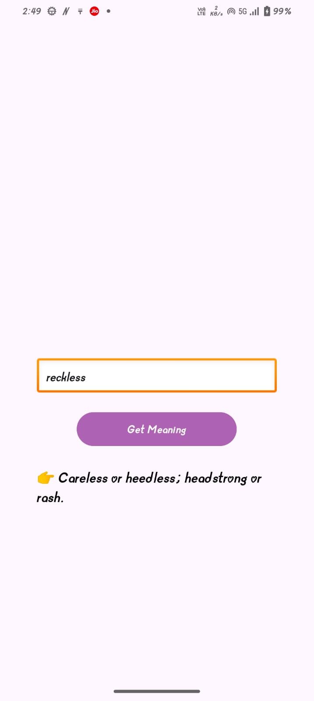

# 📖 Dictionary App

A simple Dictionary Android App built to learn API integration using Retrofit, MVVM, and Kotlin.
It fetches word definitions from a dictionary API and displays them in a clean, simple UI.

# 📌 Features

Search for word definitions.

Displays:

📝 Word

📖 Definition(s)

🔤 Part of speech (optional, if API provides)

Uses MVVM architecture with Repository pattern.

Demonstrates Retrofit API integration with coroutines and LiveData.

Lightweight and simple UI, ideal for beginners learning APIs.

# 🛠️ Tech Stack

Language: Kotlin

Architecture: MVVM (Model–View–ViewModel)

Networking: Retrofit + Gson Converter + OkHttp

Async: Kotlin Coroutines & LiveData / Flow

UI: RecyclerView, Material Components, ViewBinding

# 🌐 API Used

Free Dictionary API ( https://dictionaryapi.dev/
)

Fetches word definitions in JSON format.

## Sample fields:

{

  "word": "example",
  
  "meanings": [
  
    {
    
      "partOfSpeech": "noun",
      
      "definitions": [
      
        {
        
          "definition": "A thing characteristic of its kind or illustrating a general rule.",
          
          "example": "This is an example sentence."
          
        }
        
      ]
      
    }
  ]
}

# screenshots

### INPUT

### OUTPUT

# 📂 Project Structure

app/

 └─ src/main/java/com/example/dictionaryapp/
 
    ├─ data/
    │   ├─ api/ApiService.kt
    │   ├─ api/RetrofitInstance.kt
    │   └─ model/DictionaryResponse.kt
    ├─ repository/DictionaryRepository.kt
    ├─ ui/
    │   ├─ DictionaryViewModel.kt
    │   ├─ DictionaryAdapter.kt
    │   └─ MainActivity.kt

# 📐 Class Diagram

classDiagram
    class ApiService {
        +getDefinition(word: String)
    }

    class RetrofitInstance {
        +api: ApiService
    }

    class DictionaryRepository {
        +fetchDefinition(word: String)
    }

    class DictionaryViewModel {
        -repository
        +definition: LiveData
        +fetchDefinition(word: String)
    }

    class MainActivity {
        -adapter
        +observeViewModel()
        +showDefinition()
    }

    class DictionaryAdapter {
        -items: List<Definition>
        +bind(word, definition, partOfSpeech)
    }

    class DictionaryResponse {
        -word: String
        -meanings: List<Meaning>
    }

    ApiService --> RetrofitInstance
    RetrofitInstance --> DictionaryRepository
    DictionaryRepository --> DictionaryViewModel
    DictionaryViewModel --> MainActivity
    MainActivity --> DictionaryAdapter
    DictionaryAdapter --> DictionaryResponse

# 🚀 Future Enhancements

Add search history and recent searches.

Display pronunciation audio (if API provides).

Add word of the day feature.

Implement offline caching using Room database.

Add themes (light/dark) for better UX.
